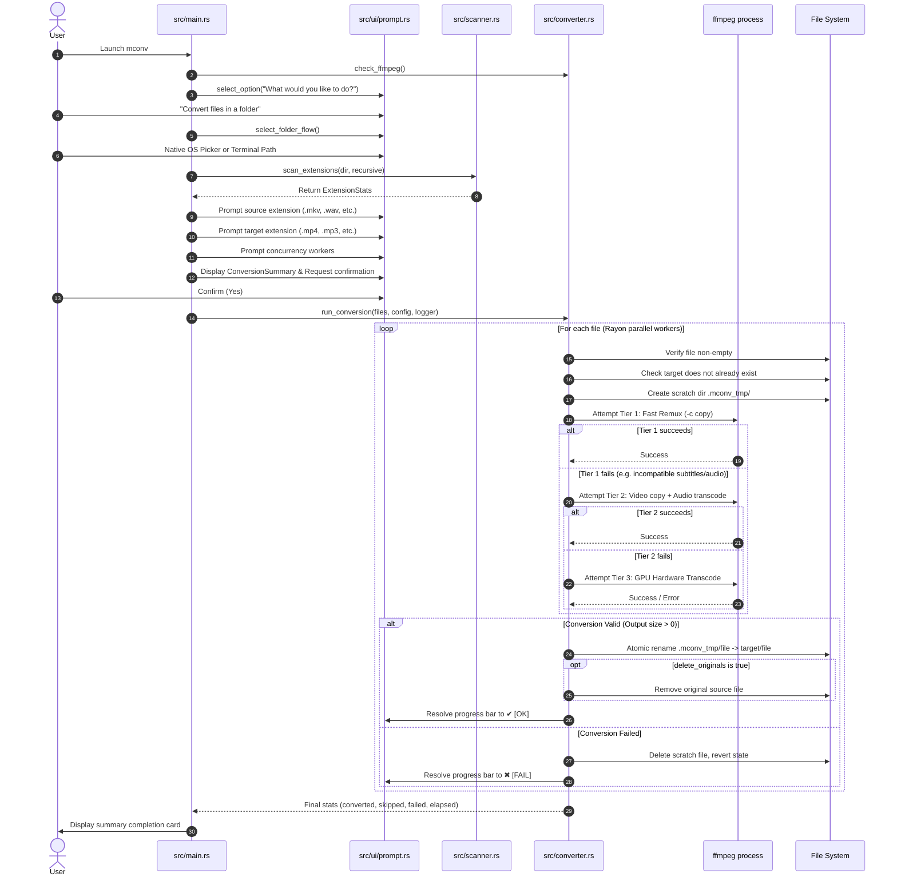

# mconv Architecture & Developer Guide

## 1. Overview & Architectural Philosophy

`mconv` is an interactive, high-performance terminal media converter engineered in Rust. It replaces legacy bash/dialog scripts with a modern, type-safe, multi-threaded engine designed around four core tenets:

1. **Defensive Safety First**: Original files are never modified in-place or deleted on error. All transcode operations occur in a hidden scratch directory (`.mconv_tmp/`), verified for non-zero file size, and atomically renamed.
2. **Stream Copy Optimization (Fast Remux)**: Transcoding video is CPU/GPU intensive. When changing container formats (e.g., MKV to MP4), `mconv` attempts direct bitstream copying first (`-c copy`), achieving 1000x–3000x real-time speedups (seconds instead of tens of minutes).
3. **Hardware Acceleration Autodetect**: When transcoding is unavoidable, the engine dynamically probes for Apple Silicon VideoToolbox, NVIDIA NVENC, or Intel QuickSync hardware ASICs.
4. **Minimal Binary Footprint**: By eliminating heavy transitive dependencies (e.g., `chrono`, `walkdir`) in favor of standard library abstractions and POSIX bindings (`libc`), the entire release binary is only **~608 KB**.

---

## 2. Project Layout & Module Responsibilities

```
mconv-project/
├── Cargo.toml                 # Profile optimization & dependency manifest
├── build.sh                   # Release build pipeline & binary distribution
├── install.sh                 # Global PATH installer
├── README.md                  # User-facing manual & quick start
├── DOCUMENTATION.md           # Developer architecture & system flow (this file)
├── dist/
│   └── mconv                  # Stripped release binary (~608 KB)
├── src/
│   ├── lib.rs                 # Library root exporting public modules
│   ├── main.rs                # CLI entry point, menu loop, and workflow orchestration
│   ├── converter.rs           # Multi-threaded conversion engine, FFmpeg pipe, & disk check
│   ├── formats.rs             # Format catalog, media categories, and transcode presets
│   ├── logger.rs              # Thread-safe audit logger writing to ~/.mconv/logs/
│   ├── picker.rs              # Native OS file dialog integration (macOS/Linux/Windows)
│   ├── progress.rs            # Multi-progress bar coordinator with atomic counters
│   ├── scanner.rs             # Recursive filesystem crawler and extension indexer
│   └── ui/
│       ├── banner.rs          # 24-bit TrueColor gradient banner & Claude-style title tile
│       ├── prompt.rs          # Raw-mode interactive prompts with collapsible completion
│       └── summary.rs         # Pre-flight conversion plan summary card
└── tests/
    └── conversion_test.rs     # Integration test suite (mock inputs, transcode, safety)
```

### Module Breakdown

| Module | Core Responsibility |
| :--- | :--- |
| [`src/main.rs`](src/main.rs) | Coordinates interactive wizard flows (`flow_convert`, `flow_find`, `flow_view_log`), terminal lifecycle, and confirmation gates. |
| [`src/converter.rs`](src/converter.rs) | Manages Rayon worker thread pools, process execution (`ffmpeg`), stream parsing (`out_time_us`), GPU detection, and atomic staging. |
| [`src/formats.rs`](src/formats.rs) | Pure data module mapping file extensions to `MediaCategory` (Video, Audio, Image, Subtitle) and their optimal FFmpeg parameters. |
| [`src/progress.rs`](src/progress.rs) | Wraps `indicatif::MultiProgress` to provide per-worker real-time progress bars alongside an overall batch status bar. |
| [`src/picker.rs`](src/picker.rs) | Spawns native OS folder dialogs (`osascript` on macOS, `zenity`/`kdialog` on Linux, PowerShell on Windows) or terminal tree fallback. |
| [`src/scanner.rs`](src/scanner.rs) | High-performance filesystem crawler using `std::fs::read_dir`, ignoring hidden folders and `.mconv_tmp` scratch spaces. |
| [`src/logger.rs`](src/logger.rs) | Append-only audit logger using POSIX `libc::localtime_r` to avoid pulling in external datetime crates. |
| [`src/ui/prompt.rs`](src/ui/prompt.rs) | Terminal driver using `crossterm` raw mode. Renders navigable options (`j`/`k`, Up/Down) and collapses into clean summary lines upon selection. |

---

## 3. End-to-End Execution Flow



---

## 4. Video Conversion Pipeline & Fallback Hierarchy

Video files have vastly different containers, codecs, and stream configurations. Naive re-encoding of all files causes severe CPU utilization and long wait times. `mconv` employs a three-tier cascaded pipeline:

```
                  ┌───────────────────────────────┐
                  │       Input Video File        │
                  └──────────────┬────────────────┘
                                 │
                                 ▼
                     [ Tier 1: Fast Remux ]
              ffmpeg -c:v copy -c:a copy -map 0:v:0 -map 0:a?
                                 │
                     ┌───────────┴───────────┐
                  Success                  Failure
                     │                       │
                     ▼                       ▼
            (Done in ~1-3 sec)     [ Tier 2: Audio Transcode ]
            1000x - 3000x speed   ffmpeg -c:v copy -c:a aac -b:a 192k
                                             │
                                 ┌───────────┴───────────┐
                              Success                  Failure
                                 │                       │
                                 ▼                       ▼
                        (Done in ~3-10 sec)   [ Tier 3: Hardware Transcode ]
                         Video untouched,       Probe GPU (VideoToolbox/NVENC/QSV)
                         audio made compliant   or fallback to fast CPU preset
```

### Why MKV to MP4 Fails with Naive `-c copy`
Matroska (`.mkv`) files frequently contain subtitle streams in ASS/SSA formats or DTS/TrueHD audio streams. The MP4 container specification rejects raw ASS subtitles. Passing `-c copy` without stream mapping causes FFmpeg to exit with error code 1.
`mconv` handles this by:
1. Mapping only primary video and available audio streams: `-map 0:v:0 -map 0:a?`.
2. If stream copying fails, falling back to Tier 2 (preserving video copy while re-encoding audio to AAC).
3. If video re-encoding is required, falling back to Tier 3 with hardware acceleration.

---

## 5. Hardware Acceleration Architecture

Hardware encoding utilizes dedicated silicon ASICs on the user's graphics card or SoC, offloading 95%+ of CPU load.

The backend is lazily evaluated once via `std::sync::OnceLock<GpuBackend>`:

```rust
pub enum GpuBackend {
    AppleVideoToolbox,
    NvidiaNvenc,
    IntelQsv,
    None,
}
```

| Platform | Codec Parameter | Hardware Engine | Typical Throughput |
| :--- | :--- | :--- | :--- |
| **macOS (Apple Silicon)** | `-c:v h264_videotoolbox -b:v 5M` | Apple Media Engine ASIC | 350 – 550 FPS |
| **Linux / Windows (NVIDIA)** | `-c:v h264_nvenc -preset p4 -cq 22` | NVENC Core | 300 – 600 FPS |
| **Linux / Windows (Intel)** | `-c:v h264_qsv -global_quality 22` | QuickSync Video | 200 – 400 FPS |
| **Generic / Fallback** | `-c:v libx264 -preset fast -crf 22` | Multi-Threaded CPU | 50 – 120 FPS |

---

## 6. Defensive Concurrency & System Protection

### Disk and CPU Throttling
Running batch conversions with unconstrained thread pools (e.g. 10+ concurrent video encodes) causes:
- Disk I/O saturation (especially on spinning drives or external USB media).
- System freezes and window manager lockups.
- Thermal throttling on mobile/laptop CPUs.

`mconv` computes an intelligent default worker count based on category:
- **Video conversions**: Clamped to `num_cpus.clamp(2, 3)` (2 to 3 workers maximum on Automatic).
- **Audio & Image conversions**: Up to 6 workers for lightweight parallel I/O.

### Low Disk Space Pre-flight
Before batch processing begins, `mconv` inspects the filesystem using POSIX `libc::statvfs`:
```rust
pub fn get_available_disk_space(path: &Path) -> Option<u64> {
    // statvfs: f_bavail * f_frsize = free bytes available to non-privileged users
}
```
If the total input batch size exceeds or nears the available disk space, a prominent warning (`[!] TIGHT DISK SPACE`) is rendered in the pre-flight summary box.

---

## 7. Binary Size Optimization (< 1 MB Blueprint)

The executable was reduced from multiple megabytes down to **~608 KB** through strategic dependency trimming and Cargo release profiles:

### 1. Dependency Tree Pruning
- **Removed `walkdir`**: Replaced with a ~40-line recursive scanner in `src/scanner.rs` using `std::fs::read_dir`. This eliminated 4 sub-crates (`same-file`, `winapi-util`, etc.).
- **Removed `chrono`**: Replaced with lightweight thread-safe POSIX `libc::localtime_r` in `src/logger.rs`. This eliminated `iana-time-zone`, `core-foundation-sys`, `num-traits`, and compiler build scripts.

### 2. Cargo Profile Tuning (`Cargo.toml`)
```toml
[profile.release]
opt-level = "z"        # Optimize for size
lto = true             # Whole-program Link Time Optimization
codegen-units = 1      # Single code generation unit for maximum dead-code elimination
panic = "abort"        # Drops stack unwinding landing pads
strip = true           # Strips symbol tables and debug information
```

---

## 8. Developer Extension Guide

### Adding a New Output Format
1. Open [`src/formats.rs`](src/formats.rs).
2. Add the extension to `VIDEO_TARGETS`, `AUDIO_TARGETS`, or `IMAGE_TARGETS`:
   ```rust
   pub const AUDIO_TARGETS: &[&str] = &[
       "mp3", "aac", "m4a", "flac", "wav", "ogg", "opus", "wma", "aiff" // <-- added aiff
   ];
   ```
3. Add the FFmpeg encoding arguments to `get_encode_args`:
   ```rust
   MediaCategory::Audio => match to_ext {
       "aiff" => vec!["-c:a", "pcm_s16be"],
       // ...
   }
   ```
4. Add the user-facing description in [`src/main.rs`](src/main.rs) under `to_options`.

### Adding Automated Tests
New tests can be added directly to [`tests/conversion_test.rs`](tests/conversion_test.rs). Synthetic test media can be generated dynamically using FFmpeg's `lavfi` (virtual audio/video synthesizer) without needing checked-in binary blobs:
```rust
Command::new("ffmpeg")
    .args(&["-y", "-f", "lavfi", "-i", "sine=frequency=1000:duration=1", output_path])
    .output();
```
