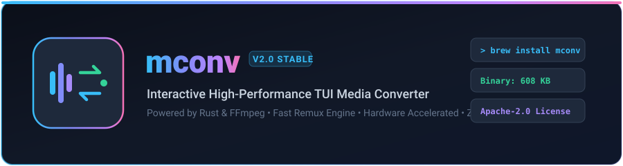

<div align="center">



<br/>

[](https://github.com/mconv/mconv/actions/workflows/ci.yml)
[](https://github.com/mconv/mconv/releases)
[](LICENSE)
[](dist/mconv)
[](https://github.com/mconv/mconv)

<p align="center">
  A blazing-fast, interactive terminal media converter written in <b>Rust</b> with a Vite-inspired TUI,<br/>
  native OS file pickers, real-time parallel progress bars, and zero-loss safety guarantees powered by <b>FFmpeg</b>.
</p>

[User Guide](USER_GUIDE.md) • [Architecture Guide](DOCUMENTATION.md) • [Contributing](CONTRIBUTING.md) • [Changelog](CHANGELOG.md)

</div>

<hr/>

```
  ╭──────────────────────────────────────────────────────────────╮
  │  ● mconv  v2.0.0             High-Performance Media Engine   │
  │  Fast, defensive batch audio/video/image transcoder          │
  ╰──────────────────────────────────────────────────────────────╯

  ◆  Select target folder
  │  Pick how you want to choose the folder
  │  ● ❯ [OS]   Open Native OS Folder Picker
  │    ○ [DIR]  Current Directory (/Users/user/Movies)
  │    ○ [PATH] Enter / Paste Path Manually
  │    ○ [TREE] Browse Folder Tree
  │
```

---

## Key Highlights

- **Lightweight Footprint**: Standalone native binary of only **~608 KB** with zero heavyweight runtime dependencies.
- **Fast Stream-Copy Remuxing**: Copies video streams without transcoding when changing containers (e.g. MKV to MP4 in 1–3 seconds at ~2000x real-time speed).
- **Hardware Acceleration**: Automatically detects and activates Apple Silicon VideoToolbox (`h264_videotoolbox`), NVIDIA NVENC (`h264_nvenc`), and Intel QuickSync (`h264_qsv`).
- **Zero-Loss Defensive Safety**: All conversions transcode to isolated hidden scratch files (`.mconv_tmp_<stem>.<ext>`) with atomic renames. Original files are never touched on failure or cancellation.
- **Parallel Multi-Progress Display**: Live individual worker bars with speed (`x`), elapsed time, ETA, and in-place resolution to clean single-line summaries (`[OK]`, `[FAIL]`, `[SKIP]`).
- **Native OS Folder Picker**: Seamlessly triggers macOS Finder dialog (`osascript`), Linux `zenity`/`kdialog`, or Windows folder modals directly from the terminal.

---

## Installation

### Method 1: Homebrew (macOS & Linux)

```bash
# Tap repository and install mconv
brew tap mconv/mconv
brew install mconv
```

### Method 2: Cargo (from Git or Crates.io)

```bash
cargo install --git https://github.com/mconv/mconv.git
```

### Method 3: Pre-built Standalone Binaries

Download pre-compiled standalone executables for your architecture from the [GitHub Releases](https://github.com/mconv/mconv/releases) page:
- **macOS Apple Silicon**: `mconv-aarch64-apple-darwin.tar.gz`
- **macOS Intel**: `mconv-x86_64-apple-darwin.tar.gz`
- **Linux (x86_64)**: `mconv-x86_64-unknown-linux-gnu.tar.gz`
- **Windows (x64)**: `mconv-x86_64-pc-windows-msvc.zip`

Extract and move the binary to your system PATH:
```bash
sudo mv mconv /usr/local/bin/
```

### Method 4: Build from Source

```bash
# Clone repository
git clone https://github.com/mconv/mconv.git
cd mconv

# Compile optimized release executable
./build.sh

# Run executable
./dist/mconv
```

---

## Requirements

- **FFmpeg**: Required runtime dependency for media multiplexing and encoding.
  - **macOS**: `brew install ffmpeg`
  - **Ubuntu / Debian**: `sudo apt install ffmpeg`
  - **Arch Linux**: `sudo pacman -S ffmpeg`
  - **Windows**: `winget install Gyan.FFmpeg`

---

## Supported Media Formats

| Category | Input Extensions | Target Extensions |
| :--- | :--- | :--- |
| **Video** | `mp4`, `mkv`, `avi`, `mov`, `wmv`, `flv`, `webm`, `mpg`, `mpeg`, `m4v`, `ts`, `3gp` | `mp4`, `mkv`, `webm`, `avi`, `mov`, `flv`, `gif` |
| **Audio** | `mp3`, `wav`, `flac`, `aac`, `ogg`, `m4a`, `wma`, `opus`, `aiff` | `mp3`, `aac`, `m4a`, `flac`, `wav`, `ogg`, `opus`, `wma` |
| **Image** | `jpg`, `jpeg`, `png`, `gif`, `bmp`, `webp`, `tiff`, `tif` | `png`, `jpg`, `webp`, `bmp`, `gif`, `tiff` |
| **Subtitle** | `srt`, `vtt`, `ass`, `ssa`, `sub` | `srt`, `vtt`, `ass` |

For detailed format presets and audio bitrates, see the [User Guide](USER_GUIDE.md).

---

## Command Line Usage

Launch interactive wizard:
```bash
mconv
```

View version:
```bash
mconv --version
```

Display help:
```bash
mconv --help
```

---

## Project Documentation

- **[User Guide (USER_GUIDE.md)](USER_GUIDE.md)**: In-depth usage walkthrough, folder picker instructions, and audio/video transcode options.
- **[Architecture & Developer Guide (DOCUMENTATION.md)](DOCUMENTATION.md)**: Internal module structure, 3-tier remux pipeline, hardware acceleration matrix, and concurrency throttling.
- **[Contributing Guidelines (CONTRIBUTING.md)](CONTRIBUTING.md)**: Instructions for submitting bug reports, features, and pull requests.
- **[Changelog (CHANGELOG.md)](CHANGELOG.md)**: Version history adhering to Keep a Changelog.
- **[Security Policy (SECURITY.md)](SECURITY.md)**: Security vulnerability reporting procedures.

---

## License

This project is licensed under the [Apache License, Version 2.0](LICENSE).
